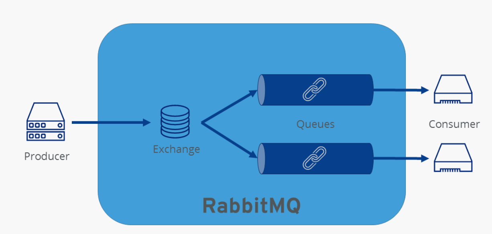
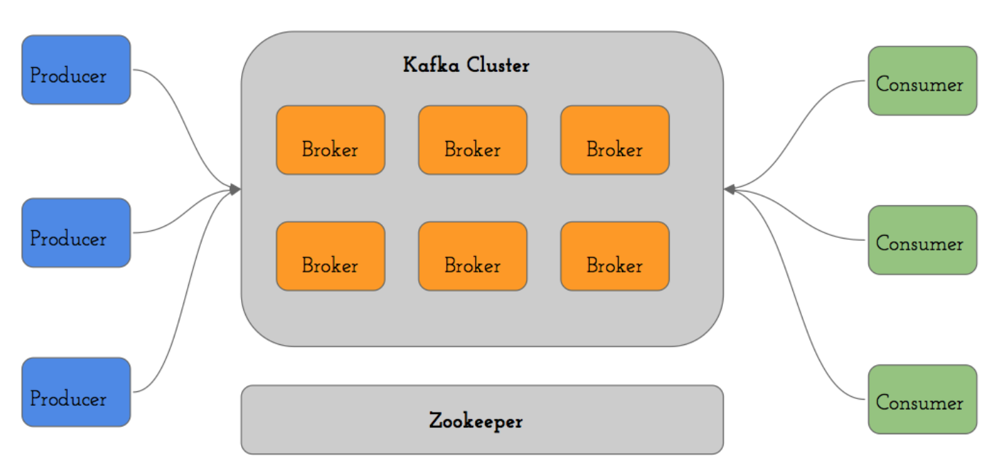

## Qu'est ce qu'un agent de message ?
Un agent de messages peut valider, transformer et rediriger les messages.
Pour faire simple c'est un système qui interroge un serveur sans attendre de réponse immédiate de sa part.
Le client (navigateur) et le serveur (web) n’ont pas besoin d’être disponibles au même moment.

Une communication asynchrone ne peut se faire sans la présence d’un MOM (Message Oriented Middleware) entre le client
et le serveur. Ce middleware va permettre de mettre en attente les messages envoyés par le client en direction du
serveur, et inversement.

## Les différents outils

### Rabbit MQ
RabbitMQ est l'un des courtiers de messages open source les plus populaires due au fait qu'il est rapide à mettre en
place et est utilse dans de nombreuses situations.
Il utilise le protocole Advanced Message Queuing (AMQP) et à été développé à partir du langage de programmation Erlang.

Un message passe par plusieurs étapes :
- Producer : génère le message
- Exchange : transmet le message
- Queue : stocke le message
- Consumer : traite le message

 

RabbitMQ nécessite des ports car la communication fonctionne via TCP.
Ces ports ne doivent pas être fermés ou bloqués par d’autres applications.

### Apache Kafta
Kafka est un système de messagerie distribué conçu pour facilement monter en charge et supporter des débits de données
très importants.

Avec ce système, un producteur de messages (appelé Publisher) doit publier son message au sein d’un topic, tandis qu’un consommateur (appelé Consumer)
doit s’abonner à un topic pour pouvoir lire les messages. C’est ce qu’on appelle le Publish/Subscribe.

 

## Glossaire

- [https://www.rabbitmq.com/](https://www.rabbitmq.com/)
- [https://www.ionos.fr/digitalguide/sites-internet/developpement-web/rabbitmq/](https://www.ionos.fr/digitalguide/sites-internet/developpement-web/rabbitmq/)
- [https://blog.engineering.publicissapient.fr/2016/03/04/apache-kafka-une-plateforme-centralisee-des-echanges-de-donnees/](https://blog.engineering.publicissapient.fr/2016/03/04/apache-kafka-une-plateforme-centralisee-des-echanges-de-donnees/)
